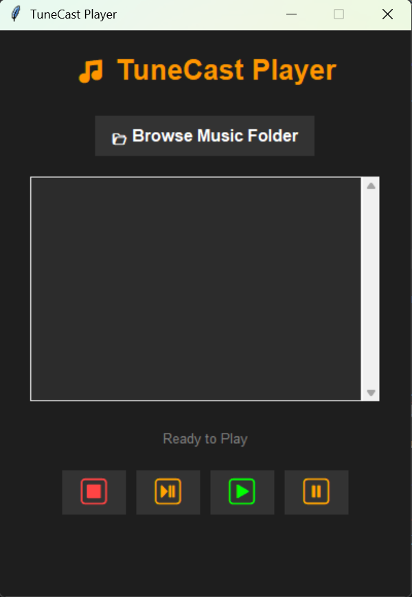

# 🎵 TuneCast: Modern Python Music Player

## 🎯 Project Overview
**TuneCast Player** is a lightweight, interactive desktop music application built using Python. It features a modern, clean Graphical User Interface (GUI) that allows users to seamlessly browse their local directories, load MP3 tracks, and control audio playback.

## ✨ Key Features
*   **Modern UI/UX:** Designed with a sleek dark theme, utilizing text-based Unicode icons for media controls to eliminate dependencies on external image files.
*   **Local Directory Access:** Built-in integration to browse and load multiple `.mp3` files directly from the user's computer into a scrollable playlist.
*   **Robust Media Controls:** Fully functional Play, Pause, Resume, and Stop controls powered by the Pygame engine.
*   **Real-Time Status & Error Handling:** Displays the currently playing track and gracefully handles errors (e.g., attempting to play without selecting a song) without crashing.

## 🛠️ Tech Stack
*   **Programming Language:** Python 3
*   **GUI Framework:** Tkinter
*   **Audio Engine:** Pygame (`mixer` module)
*   **File Handling:** OS module

## 📂 Repository Files
*   `music_player.py` - The standalone Python script containing all UI logic, event handling, and audio processing.
*   `TuneCast_Preview.png` - HD screenshot of the modern application interface.

## 🚀 How to Run Locally
1. Clone this repository to your local machine.
2. Ensure you have Python installed on your system.
3. Install the required audio library by running:
   ```bash
   pip install pygame

## 📸 Application Preview

